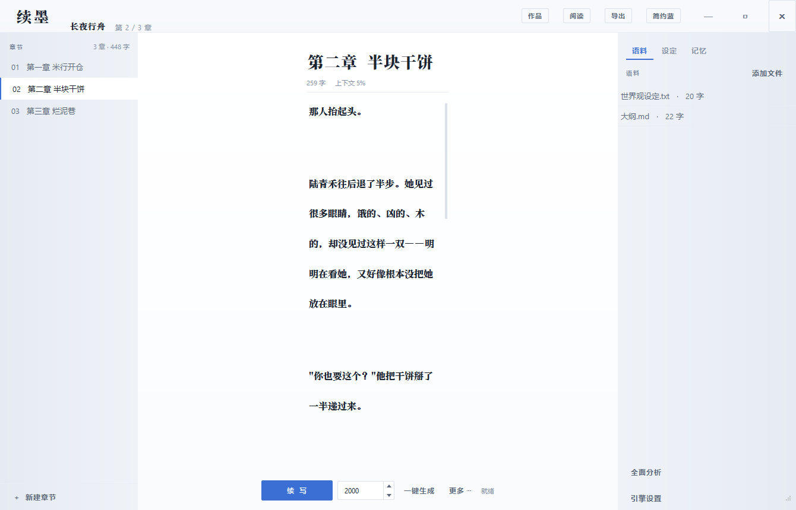
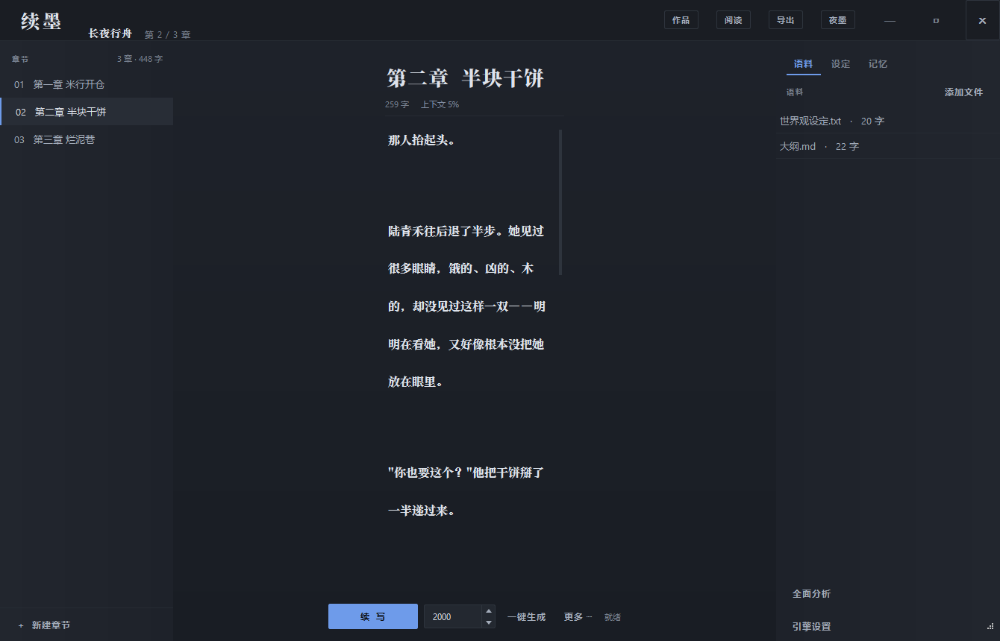
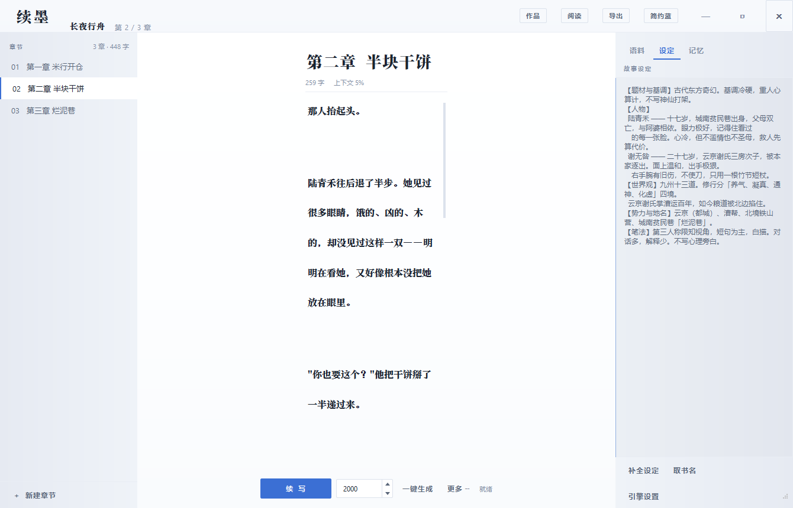
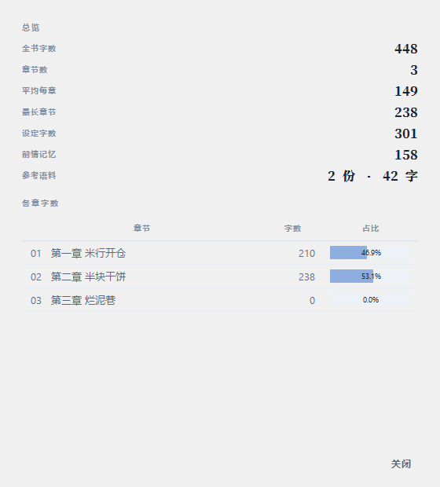
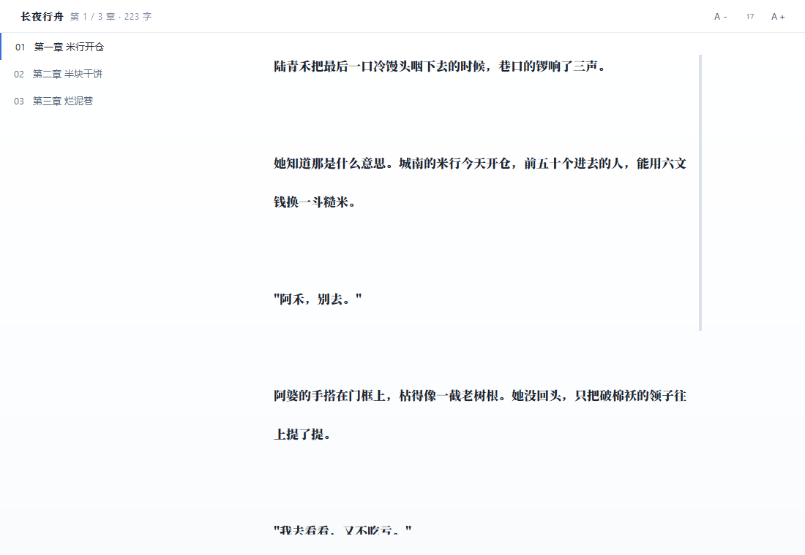

# XUMO (续墨)

**English** · [简体中文](README.md)

A desktop workbench for continuing Chinese long-form novels. Its one job: after a few
hundred thousand characters, the model still remembers who the characters are, where
the foreshadowing was planted, and how the prose is supposed to sound.




<details>
<summary>More screenshots (night palette / settings / stats / reader)</summary>






</details>

## The problem

Writing a long novel through a chat box breaks down around 200k characters. The model
forgets the protagonist's teacher's name, forgets that the knife was lost in the
previous chapter, forgets whether the book is first or third person. You re-explain
everything each turn, and it still doesn't stick.

XUMO treats "make the model remember" as the core problem. Premise, prior-context
memory, reference corpus and the tail of the current chapter are assembled into one
context block and injected on every request. Text that overflows the budget is
compressed into a recap and appended to memory, so the window never runs out and the
story never drops the thread.

## How it compares

The space is not new, and several projects go deeper than XUMO. Mechanism-level
differences only; check each project's own repository for current details.

| Project | Form | Long-form consistency | Anti-AI-tell | Setup |
|---|---|---|---|---|
| **XUMO** | Desktop GUI, portable single-file exe | 4-layer injection; auto-compress overflow | Prompt-level style bans (below) | Download the exe |
| InkOS | CLI | 7 "truth files" + 33-dimension continuity audit | 11 deterministic rules + spot-fix; external AIGC detectors | Needs Python |
| NovelScribe | pip package / CLI | 9-agent pipeline, hierarchical summaries | None dedicated | `pipx install` |
| novel-agent | Web app | LangGraph orchestrating 12 agents, ChromaDB retrieval | None dedicated | Needs Docker |
| AI-Writer | CLI | None; relies on the local model | None | Needs a GPU |
| KoboldAI / KoboldCpp | Browser frontend | Hand-maintained World Info entries | None | Needs a local model and VRAM |

XUMO's shortcomings are plain: no multi-agent orchestration, no audit loop, no vector
retrieval, no web client. What it trades for is three things none of the above do:

1. **Works out of the box.** It ships as a single portable `.exe`; novel data lives in a
   `projects` folder next to the exe, so moving the exe moves your work.
2. **Exactly one runtime dependency, PyQt6.** The SSE streaming client, backoff retries
   and truncation auto-continuation in `ai.py` are hand-written on `urllib` from the
   standard library. No openai SDK, no requests, no LangChain.
3. **In-place streaming rewrites.** Select a passage, pick polish / expand / condense /
   rewrite, and text grows in place sentence by sentence. Esc keeps what was already
   generated; if nothing was produced, the original is restored automatically.

## Quick start

Requires Python 3.10+.

```bash
pip install -r requirements.txt
python main.py
```

Open "引擎设置" (Engine Settings) at the bottom right and paste an API key. DeepSeek is
the default; any OpenAI-compatible endpoint (one whose `base_url` ends in `/v1`) works.

Build a portable exe on Windows:

```bash
pip install pyinstaller
build.bat
```

## Features

- **Premise.** Write a sentence, then let the AI expand it into characters, power tiers,
  factions and place names. Or ask it for title candidates.
- **Drafting.** Continue (Ctrl+Enter) or auto-generate up to a target length. Empty drafts
  use an opening mode that starts on a concrete scene with a hook.
- **Self-updating premise.** After auto-generation, the app reads the whole manuscript and
  folds new characters, events and foreshadowing into the premise.
- **Rewrites.** Polish / expand / condense / rewrite on a selection, streamed in place.
- **Truncation handling.** When a reply is cut off mid-sentence, the app re-requests with
  the partial text fed back and asks it to continue without repeating, up to 4 rounds.
- **Plus** writing statistics, version history with undoable rollback, a dedicated reader
  window, three palettes, chapter drag-and-drop and merging, drag-and-drop corpus import,
  and export to text.

## Context assembly

Four layers, in priority order:

| Layer | Source | Role |
|---|---|---|
| Premise | Written, AI-expanded, auto-analyzed | Characters, world, tiers, factions, prose style |
| Prior-context memory | Compressed from older text | Carries history beyond the window |
| Reference corpus | Files you import | Hard constraints, must not be contradicted |
| Recent window | Tail of the current chapter | Keeps sentences continuous |

## Style bans: why the output doesn't read like AI

What exposes AI fiction isn't plot, it's that the model **thinks it's being literary**:
three metaphors per paragraph, walls of adjectives, rule-of-three lists,
"a flicker crossed his eyes"-grade filler. Readers spot it in two paragraphs and stop.

`ai.py` defines a single `STYLE_BAN` block shared by the continuation, opening and
rewrite prompts: at most one metaphor per paragraph, at most three adjectives, no
rule-of-three, no nominalized emotions, no narrator's editorializing, mandatory
long/short sentence interleaving, plus a blacklist of stock phrases.

Real-world testing is ongoing. Try it on your own manuscript and open an issue if it
doesn't pull its weight.

## Known limitations

- **No model included.** You must supply an OpenAI-compatible API key.
- **The anti-AI-tell mechanism is prompt-only.** Nothing deterministically catches
  violations yet; a rules-based detector like InkOS's is on the roadmap.
- **Prompt changes have not been tested end-to-end against a live API** (no key
  available). The 75 smoke-test assertions cover context assembly and logic, not
  generation quality.
- **No CI.** Tests are run manually.
- **Chinese UI only.** No web or mobile client.

## Roadmap

- [ ] Upgrade the anti-AI-tell work from prompts to deterministic rules + spot-fix
- [ ] Run `smoke_test.py` in GitHub Actions
- [ ] Foreshadowing ledger: list planted hooks and flag uncollected ones
- [ ] Style fingerprint distilled from reference corpus, injected into prompts

## Project layout

```
theme.py        design tokens and stylesheets (three palettes)
store.py        data model, one JSON file per novel, under projects/
ai.py           streaming, context assembly, memory compression, rewrites
ui.py           UI
main.py         entry point
smoke_test.py   smoke tests (75 assertions, needs PyQt6)
build.bat       Windows packaging script
screenshots/    images used by the READMEs
```

```bash
python smoke_test.py
```

The tests instantiate the real main window and every dialog, and exercise the rewrite
path, dedup algorithms, snapshot rollback and sampling-parameter rules. They run entirely
inside a temp directory and never touch your novel library.

## Data and backups

Each novel is a JSON file under `projects/`. Every save first drops a snapshot into
`projects/backup`, keeping the most recent 40. "作品 → 历史版本" lists them and can roll
back; rolling back snapshots the current state first, so the rollback itself is undoable.

`projects/` contains your API key and manuscript text, which is why it is gitignored.

## License

[MIT](LICENSE)